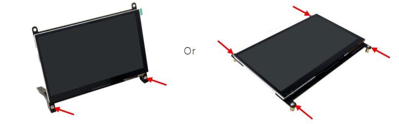
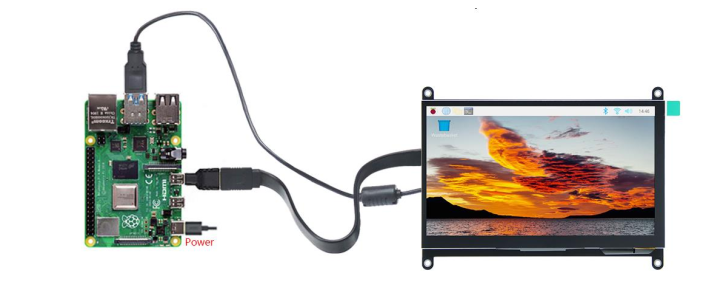
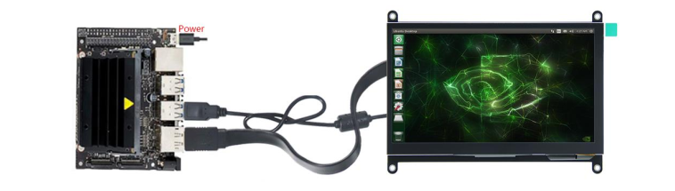
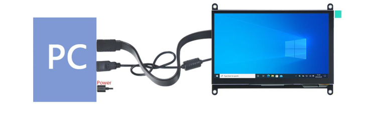

##############################################################################
FNK0055A_Tutorial
##############################################################################

How to Connect?
**************************************

First fix the two stands with two screws (standing mode) or fix four standoffs with four screws (laying mode).

**Raspberry Pi 400 / 5 / 4B / 3B+ / 3B / 3A+ / 2B / 1B+ / 1A+ run Raspberry Pi OS / Ubuntu**

.. note::

    Zero W / Zero needs USB and HDMI adapters, which are not included in this product.

You need to configure the resolution manually. Download and view the guide: http://freenove.com/fnk0055

**NVIDIA Jetson Nano Developer Kit / 2GB Developer Kit run Jetson Linux**

The resolution is usually adjusted automatically; otherwise please change the display settings.

Computers with an HDMI output port run Windows 11 / 10 / 8 / 7

The resolution is usually adjusted automatically; otherwise please change the display settings.

:red:`Having problems?` Download the latest tutorial and troubleshooting: http://freenove.com/fnk0055

Need further help? Contact our technical support by email: support@freenove.com