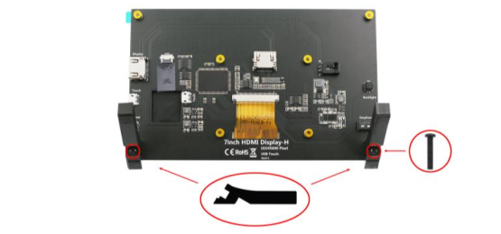
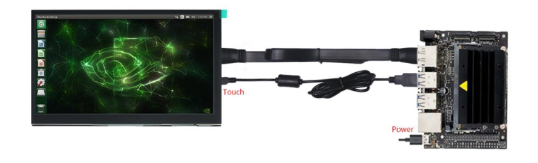
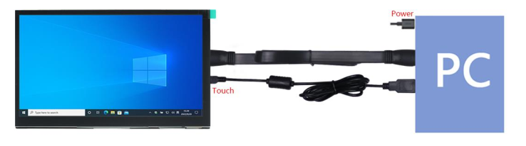
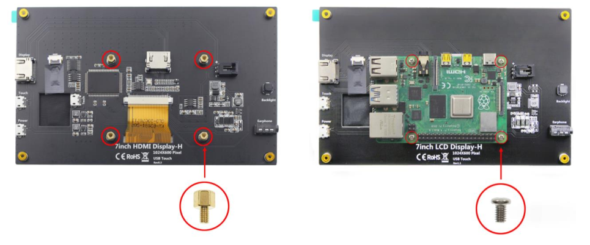
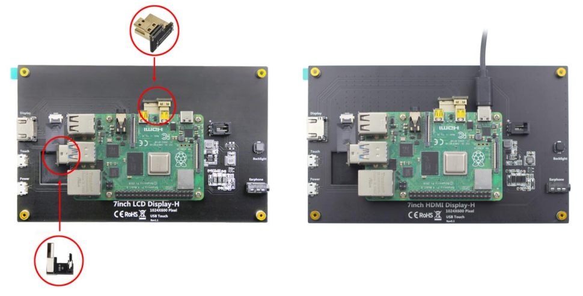

##############################################################################
FNK0055C_Tutorial
##############################################################################

How to Connect?
***********************************

**Raspberry Pi 400 / 5 / 4B / 3B+ / 3B / 3A+ / 2B / 1B+ / 1A+ run Raspberry Pi OS / Ubuntu**

(Note: Zero W / Zero needs USB and HDMI adapters, which are not included in this product.)

You need to configure the resolution manually. Download and view the guide: http://freenove.com/fnk0055

**NVIDIA Jetson Nano Developer Kit / 2GB Developer Kit run Jetson Linux**

The resolution is usually adjusted automatically; otherwise please change the display settings.

Computers with an HDMI output port run Windows 11 / 10 / 8 / 7

The resolution is usually adjusted automatically; otherwise please change the display settings.

.. note::
    
    Usually only need to connect HDMI and Touch port, no need to connect Power port.

**You can also fix your Raspberry Pi to the back of the screen.**

.. note::
    
    Only Raspberry Pi 5 / 4B / 3B+ / 3B can be fixed.

1. First, install the four standoffs. Then put on the Raspberry Pi and fasten it with four screws.

2. Connect the two connectors. Finally, connect the power supply to the Raspberry Pi.

.. note::
    
    There are different connectors for different Raspberry Pi models.

:red:`Having problems?` Download the latest tutorial and troubleshooting: http://freenove.com/fnk0055

Need further help? Contact our technical support by email: support@freenove.com