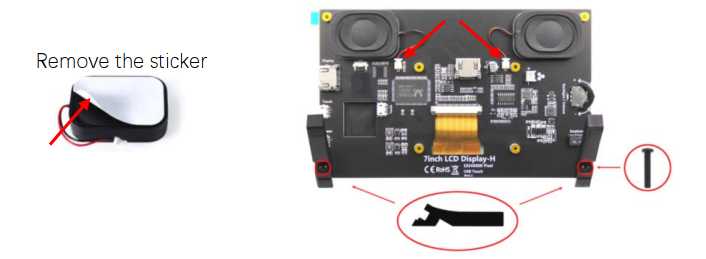
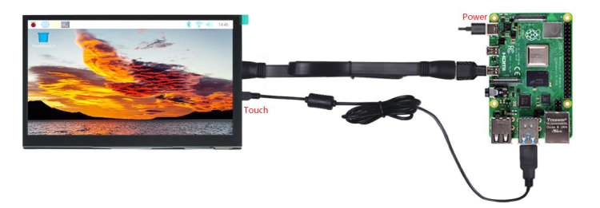
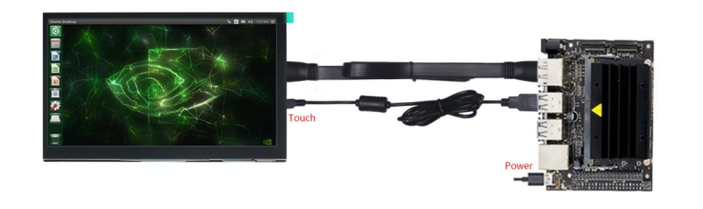
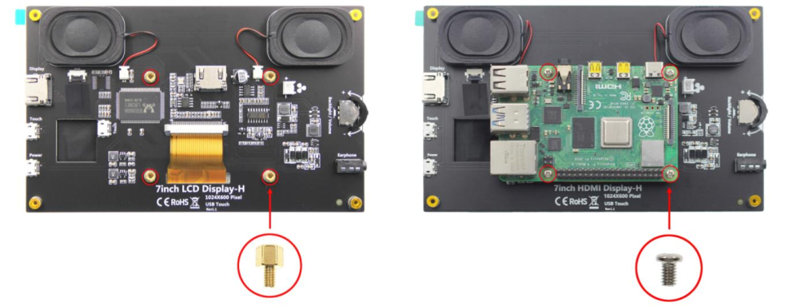
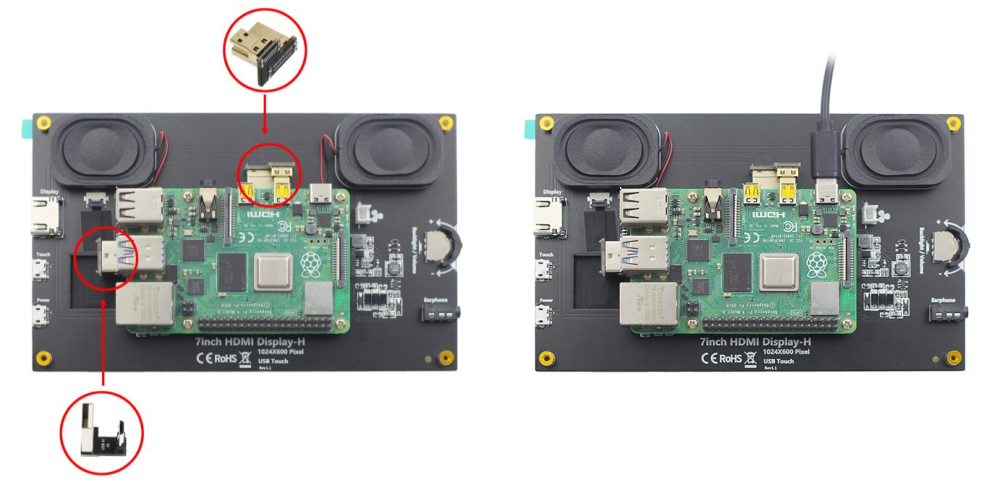

##############################################################################
FNK0055D_Tutorial
##############################################################################

How to Connect?
**************************************

First, stick the two speakers on the back of the screen and connect the cables. Then fix the two stands with two screws.

Raspberry Pi 400 / 5 / 4B / 3B+ / 3B / 3A+ / 2B / 1B+ / 1A+ run Raspberry Pi OS / Ubuntu

.. note::
    
    Zero W / Zero needs USB and HDMI adapters, which are not included in this product.

You need to configure the resolution manually. Download and view the guide: http://freenove.com/fnk0055

NVIDIA Jetson Nano Developer Kit / 2GB Developer Kit run Jetson Linux

The resolution is usually adjusted automatically; otherwise please change the display settings

**You can also fix your Raspberry Pi to the back of the screen.**

.. note::
    
    Only Raspberry Pi 5 / 4B / 3B+ / 3B can be fixed.

1. First, install the four standoffs. Then put on the Raspberry Pi and fasten it with four screws.

2. Connect the two connectors. Finally, connect the power supply to the Raspberry Pi.

.. note::
    
    There are different connectors for different Raspberry Pi models.

Power Problems
****************************************

If your device cannot provide enough power to the monitor, it may cause flickering screens, intermittent

speakers, and other similar problems. Should this happen, please connect the Power port to a USB adapter

(5V, 2A or above).

:red:`Having problems?` Download the latest tutorial and troubleshooting: http://freenove.com/fnk0055

Need further help? Contact our technical support by email: support@freenove.com